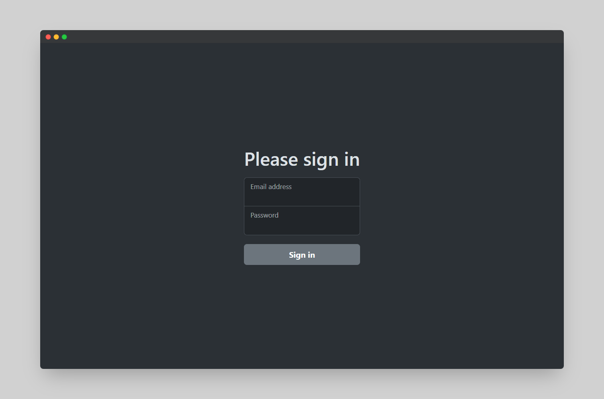
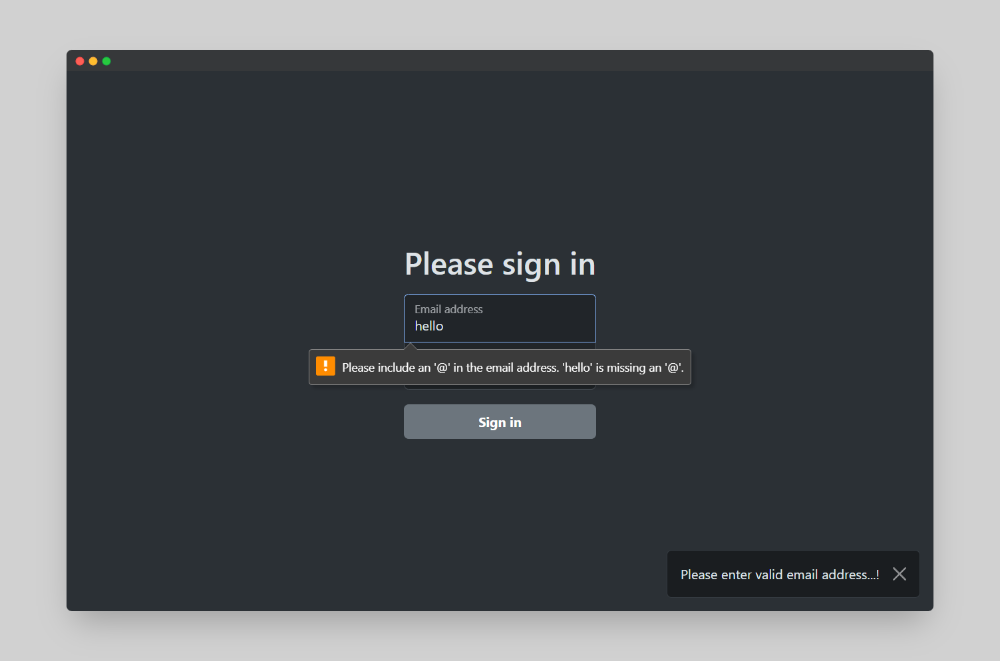
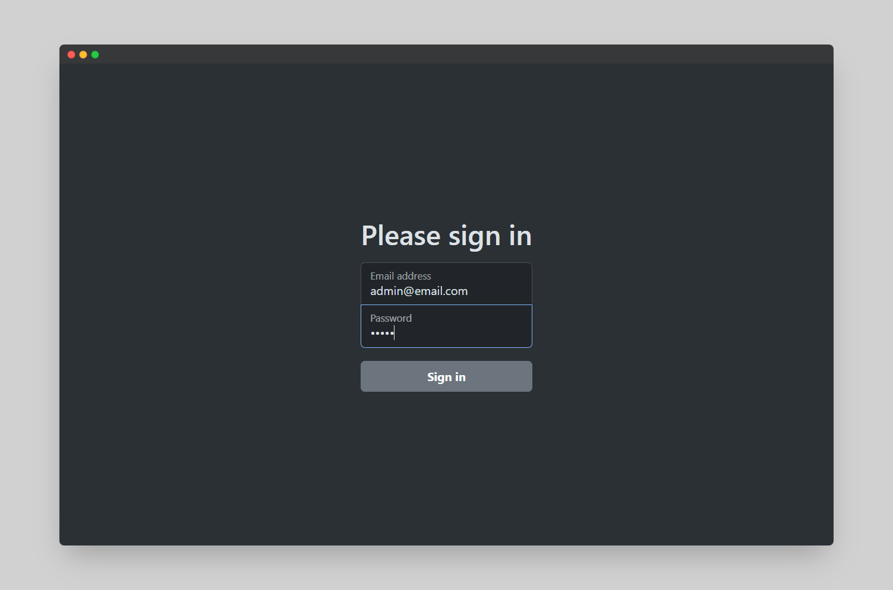
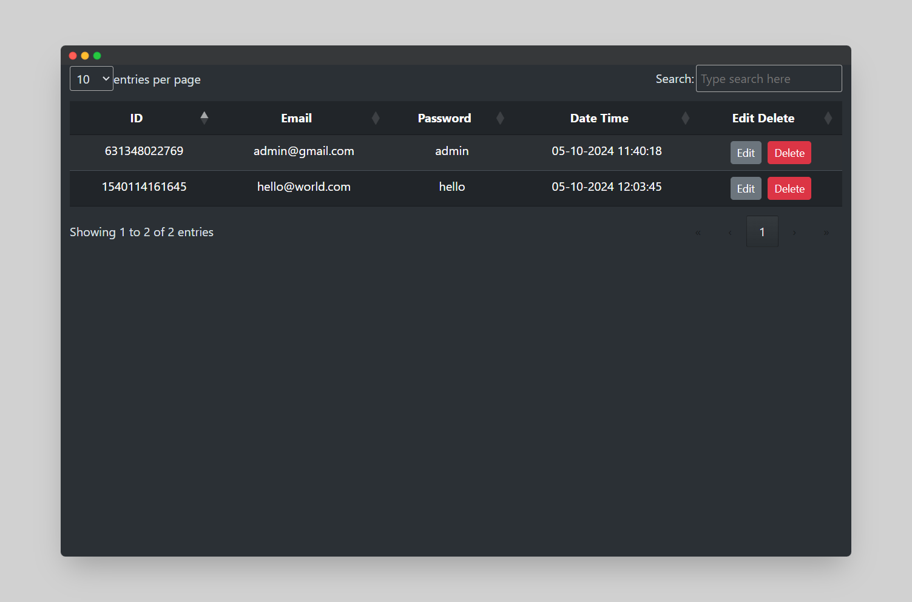

# Form Manipulation with JavaScript

A simple project demonstrating how to manipulate HTML forms using JavaScript. This project dynamically interacts with form input fields to perform various tasks like validation, submission, and field manipulation.

## Demo

You can check out the live demo of the project here:  
[Form Manipulation JS Demo](https://aarshpatel1.github.io/form-manipulation-js/)

### 1. Initial Form Display

*Initial view of the form before any interaction.*

### 2. Email Validation

*Email validation providing feedback for incorrect input.*

### 3. Add Record
[](videos/demo-video-1.mp4)

### 4. Edit and Delete Record
[](videos/demo-video-2.mp4)

## Features

- **Dynamic Form Validation:** Form input fields are validated in real-time, providing immediate feedback to the user.
- **Field Manipulation:** Fields can be dynamically enabled, disabled, and cleared using JavaScript.
- **Responsive Design:** Optimized for use on both mobile and desktop screens.
- **Form Submission Simulation:** The form simulates a submission process with feedback messages.

## Tech Stack

- **HTML5**
- **CSS3**
- **JavaScript (ES6)**

## Installation

1. Clone the repository:
    ```bash
    git clone https://github.com/aarshpatel1/form-manipulation-js.git
    ```
2. Navigate to the project directory:
    ```bash
    cd form-manipulation-js
    ```
3. Open the `index.html` file in your browser.

## Usage

- Fill out the form fields and experience dynamic input validation.
- Modify fields, enable or disable inputs, and interact with various form elements.
- The form submission simulates a real submission but doesn't send data to a server.

## Contributing

Contributions are welcome! If you have suggestions for improvements or find any bugs, feel free to open an issue or submit a pull request.
